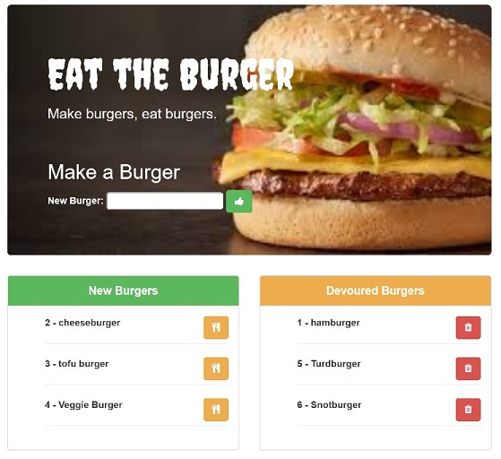
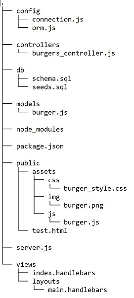

# Node, Express, MySQL, and Handlebars app "Burgers"

### A dating app that uses Express to handle routing where a user's survey is used to determine their 'best match' from other dummy or user submitted surveys.
## [Link to Live Heroku Page](https://mighty-atoll-63849.herokuapp.com/)
------------------------------------------------------------------------------------------
This is an app that lets users input the names of burgers they'd like to eat. Whenever a user submits a burger's name, the app will display the burger in `New Burgers`, the left side of the page. Each burger in the waiting area also has a button, that when clicked, will move the burger to `Devoured`, the right side of the page.

The app will store every burger in a database, whether devoured or not.

------------------------------------------------------------------------------------------
This app uses the MVC Directory design:

------------------------------------------------------------------------------------------
## To Install
* Git Clone the repository
* Navigate to the folder where the repository exists using Git Bash or Terminal.
* Run the command `npm install` to download the required dependencies.
* Create a MySQL database using the schema provided.
* Then run the command `node .\server.js` to start a local host server.

### Languages & Programs Used
  * JavaScript
  * jQuery
  * Nodejs
  * Express

### Required Node packages and other sources
* [express-handlebars]
* [body-parser]
* [mysql]
